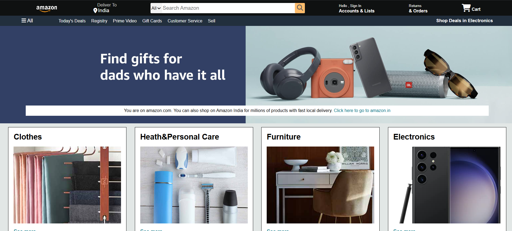

# Amazon Clone Frontend

This project is a frontend clone of the Amazon homepage, built using HTML and CSS. It replicates the look and feel of Amazon's main page, including the navigation bar, hero section, product boxes, and footer.

## Features

- Responsive navigation bar with logo, search, and cart
- Hero section with promotional banner
- Multiple product category boxes with images
- Styled footer with useful links and copyright

## Screenshots

 <!-- Add your screenshot image here -->

## Getting Started

1. **Clone the repository:**
   ```bash
   git clone https://github.com/YOUR-USERNAME/amazon-clone-frontend.git
   ```
2. **Navigate to the project folder:**
   ```bash
   cd amazon-clone-frontend
   ```
3. **Open `index.html` in your browser.**

## Folder Structure

```
amazon-clone-frontend/
│
├── index.html
├── style.css
├── amazon_logo.png
├── hero_image.jpg
├── box1_image.jpg
├── box2_image.jpg
├── box3_image.jpg
├── box4_image.jpg
├── box5_image.jpg
├── box6_image.jpg
├── box7_image.jpg
├── box8_image.jpg
└── README.md
```

## Deployment

You can deploy this project using [GitHub Pages](https://pages.github.com/):

- Push your code to GitHub.
- Go to your repository settings.
- Under "Pages", set the source to the `main` branch and `/root`.
- Your site will be live at `https://YOUR-USERNAME.github.io/amazon-clone-frontend/`.

## Credits

- [Font Awesome](https://fontawesome.com/) for icons.
- Images and design inspired by [Amazon.com](https://amazon.com).

## License

This project is for educational purposes only and is not affiliated
